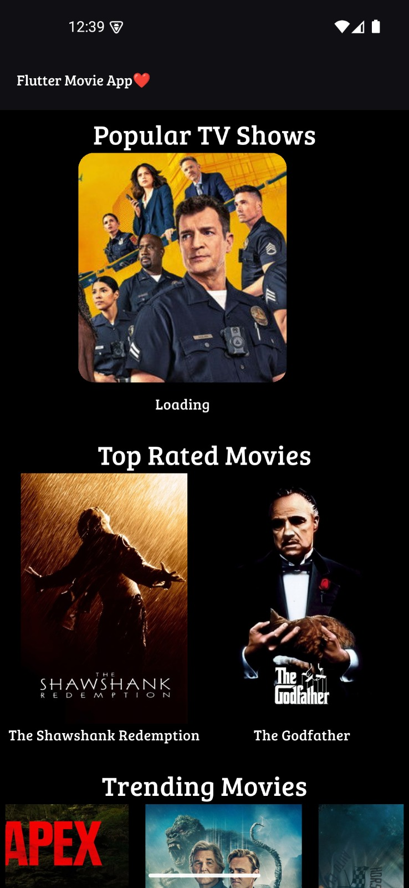
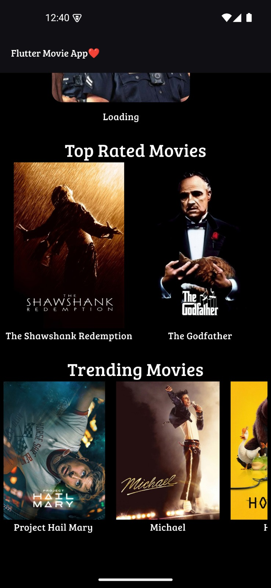

# 🎬 Flutter Movie App

A Flutter-based movie application that uses the TMDB API to display trending movies, top-rated films, and popular TV shows.

---

## 🚀 Features

- 🔥 Trending Movies
- ⭐ Top Rated Movies
- 📺 Popular TV Shows
- 🎯 Movie Detail Screen
- 🌐 API Integration (TMDB)
- ⚠️ Error Handling for null data and images

---

## 🛠 Tech Stack

- Flutter
- Dart
- TMDB API

---

## 📸 Screenshots

##  Screenshots

### Home Screen

###  Trending Movies

### 🎬 Movie Details

---

## 📌 Note

This project is built for learning and practicing Flutter development with real-world API integration.
